# Quantifying Metro Systems by Coverage and Opportunity
*Ricardo Zacarias*

# Content
- [Abstract](#Abstract)

- [Datasets](#Datasets)

- [Introduction](#Introduction)

- [Metrics](#Metrics)

- [Results](#Results)

- [Links](#links)

  

# Abstract
Statistical and probabilistic quantification of metro systems in different cities. Created an algorithm to estimate three separate geographical metrics that evaluate the coverage and availability of points of interest within a city:

1.  Average distance to the closest station from random points within the city the limits;
2. The number of metro stations within a 1km radius of random points;
3. Percentage of metropolitan area covered by metro stations.

Subway systems were subsequently ranked based on these metrics and the difference between them was tested statistically. The location intelligence applications of this project are exemplified by the use of geolocation data for the Portuguese bakery  *A Padaria Portuguesa*. Furthermore, I demonstrate that demographical data can be easily layered on the algorithm. 

# Datasets
The data required for this project was foraged from many different corners of the internet. Here are their locations.

[Lisbon Metro Coordinates](http://dados.cm-lisboa.pt/dataset/estacoes-de-metro) 

[Lisbon Administrative Divisions (Freguesias)](http://geodados.cm-lisboa.pt/datasets/freguesias-2012-1)

[NYC Subway Stations](https://data.cityofnewyork.us/Transportation/Subway-Stations/arq3-7z49)

[NYC Neighborhood Tabulation Areas](https://data.cityofnewyork.us/City-Government/Neighborhood-Tabulation-Areas-NTA-/cpf4-rkhq)

[Paris Arrondissements](https://www.data.gouv.fr/en/datasets/arrondissements-1/)

[Paris Metro Coordinates](https://www.data.gouv.fr/en/datasets/positions-geographiques-des-stations-du-reseau-ratp-ratp/)

[London Statistical Boundaries](https://data.london.gov.uk/dataset/statistical-gis-boundary-files-london)

[London Underground Locations](https://data.london.gov.uk/dataset/tfl-station-locations)

[Administrative Divisions of Moscow](https://www.kaggle.com/jtremoureux/administrative-divisions-of-moscow)

[Moscow Metro Stations](https://en.wikipedia.org/wiki/List_of_Moscow_Metro_stations) - *scraped from Wikipedia.*

### Dataset Example

*Lisbon Boundaries and Metro Stations*

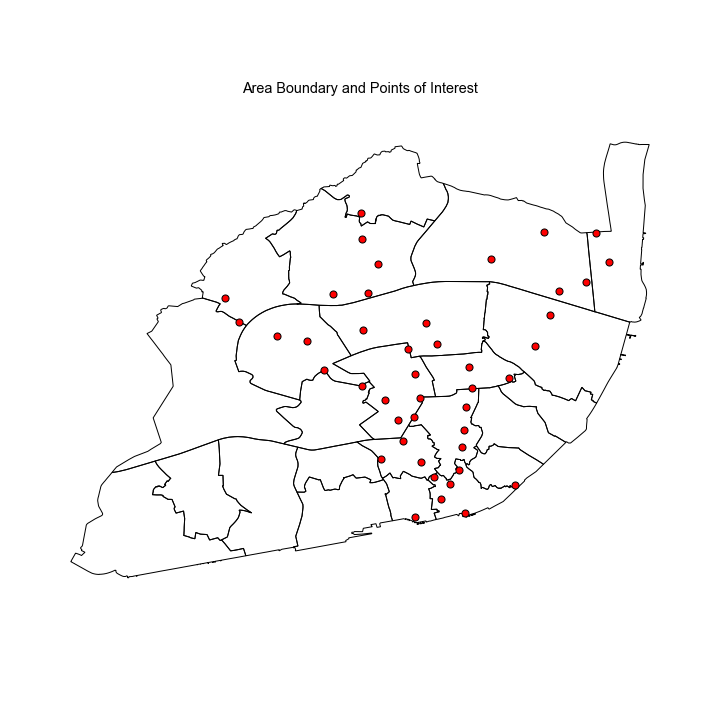

# Introduction

I wanted to work with public transportation data, but as I was doing research on which were considered to be the best metro systems in the world, it was very difficult to find any article that used quantitative measures. The majority of internet posts rank metro systems based on the design or the cleanliness of its underground stations.  So my question was: what makes a subway great?

I divided this project in two parts:

- First, I wanted to find metric to quantify the quality of the transportation system and;
- Second, use these metrics to compare between different cities.

# Metrics

1. **Average distance from a random point to a station.** I generated 5000 random points inside the city limits. For each point, I calculated the distance to every metro station and then took the minimum. This gets you the closest station. After calculating the minimum distance to each point, we obtain a distribution of distances which can be also shown in a heatmap.

   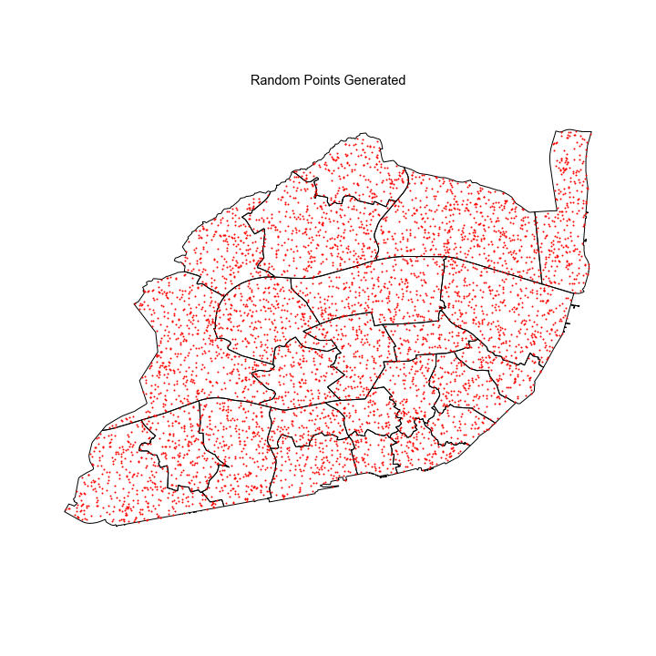

   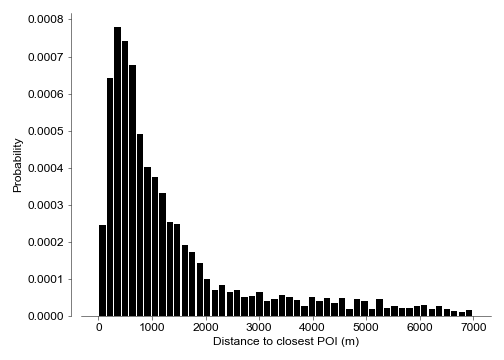

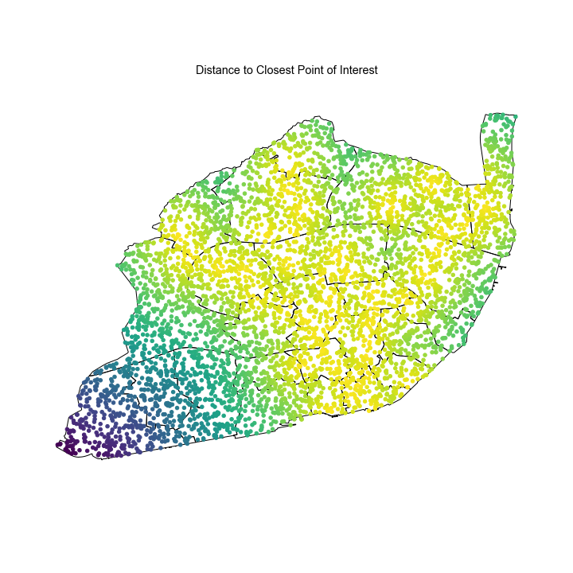

2. **Number of stations within 1km.** Essentially, I drew a circle of 1km radius around each random point and then counted how many stations you could find. Instead of distance, this metric reveals how many options you have at any point, or what it the probability of being within 1km of 0 stations, 1 station, 2 stations, and so on.

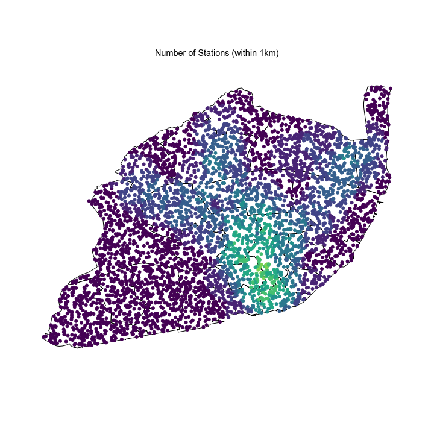

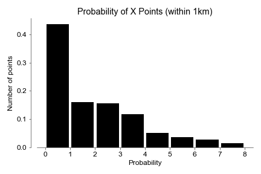

3. **Percentage of area covered.** Again, I drew 1km circles but this time around each metro station instead of the random points. Then I calculated the union between all the shapes and finally subtracted it from the total area of the city.

   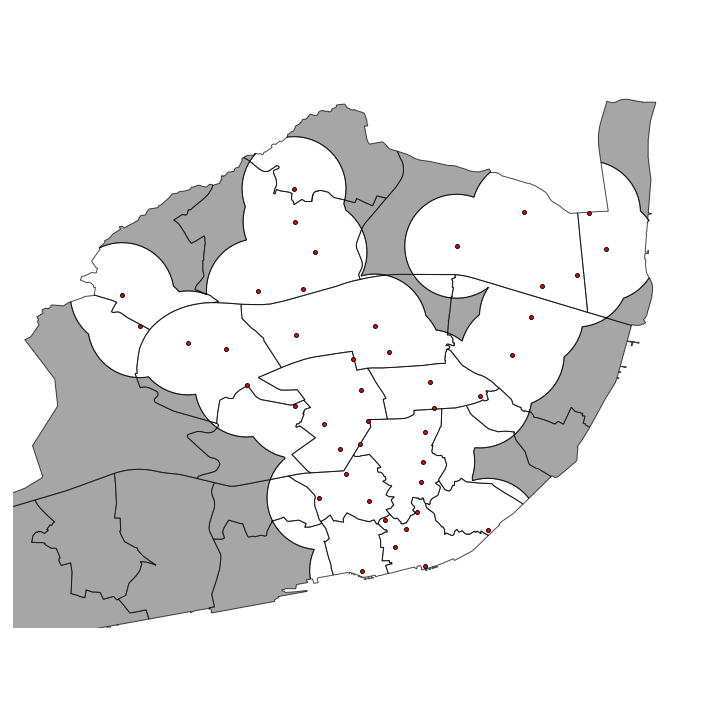

# Results

Shown above was the example for Lisbon but I also did this for **New York**, **Paris**, **London** and **Moscow**. 

### Distance to closest station

Regarding my first metric, Paris tops the list with Moscow coming in last. 

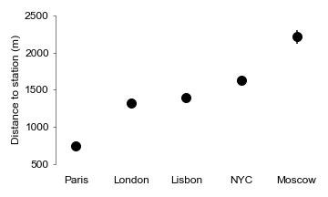

I confirmed statistical significance between groups by ANOVA (p=0), and then performed a t-test between the closest groups (London-Lisbon, p=0.04). But what is the best metro by number of options?

### Number of stations within 1km

In this next graph, we can see the probability of being within at least 2 metro stations at any point in the city. Again Paris is at the top and Moscow at the bottom.

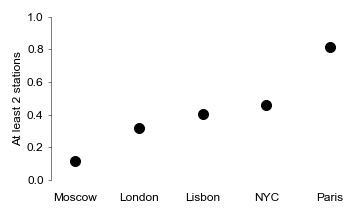

Interestingly, NYC climbed some spots. This result indicates that while average distance to a station in higher in NY, you have a higher probability of finding more than one (more options). 

### Area Covered

According to our metric, Paris has an impressive **~96%** of the city covered. It is important to note that this effect could be influence by what is considered a metropolitan area for each of these cities. Paris includes only the *arrondisements* while London has both inner and outer output areas.

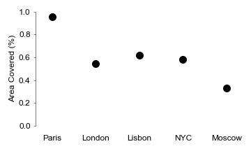

# Applications

Some interesting things you can accomplish with this analysis is that you are not restricted to public transportation. You can use any points you want. For example, I scraped the location for every shop of A Padaria Portuguesa in Lisbon and ran the same analysis. This could have relevant **location intelligence** applications.

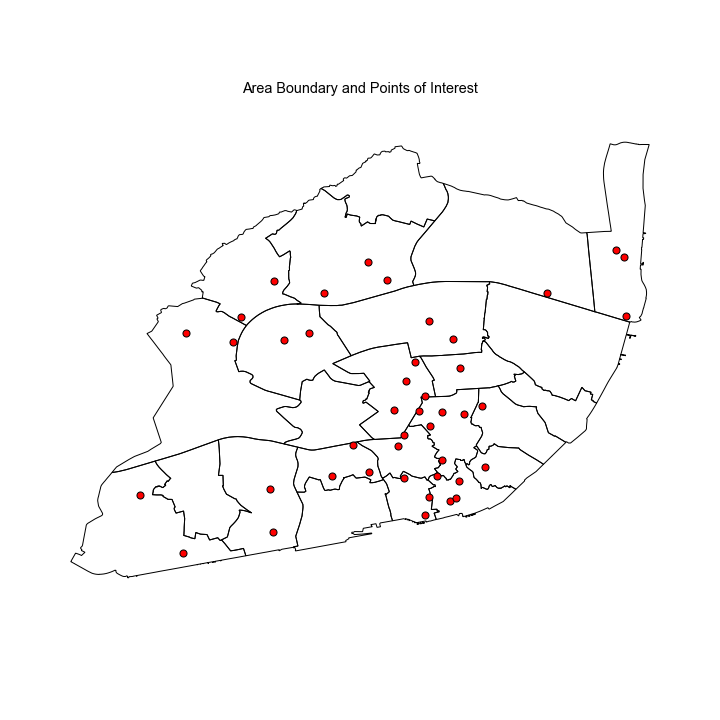

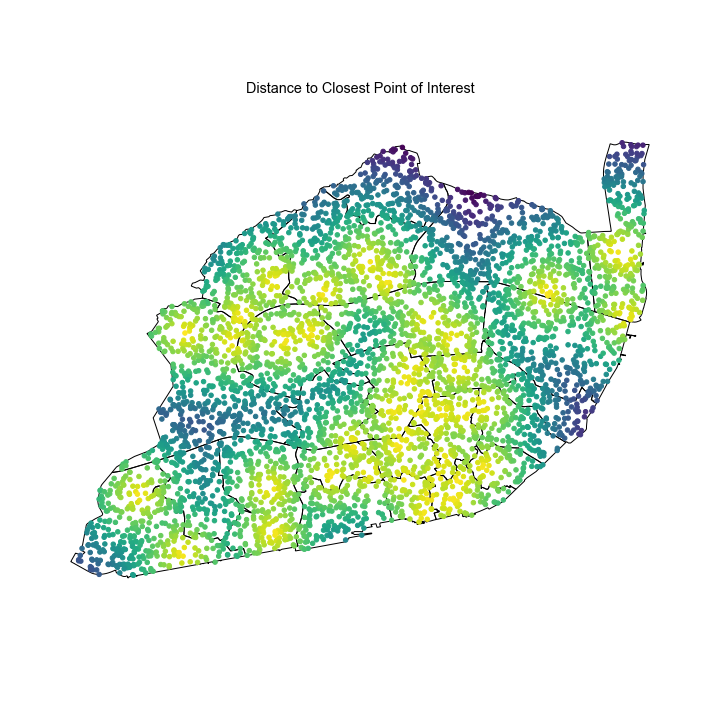

Additionally, **demographic information** can be easily layered on the algorithm. 

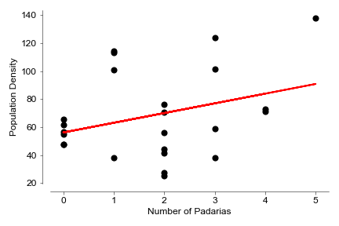

